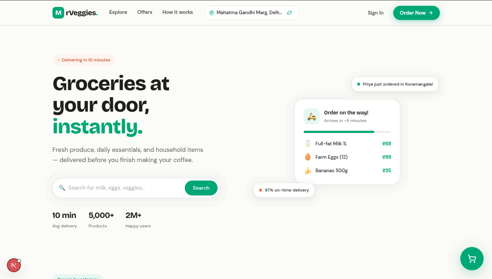
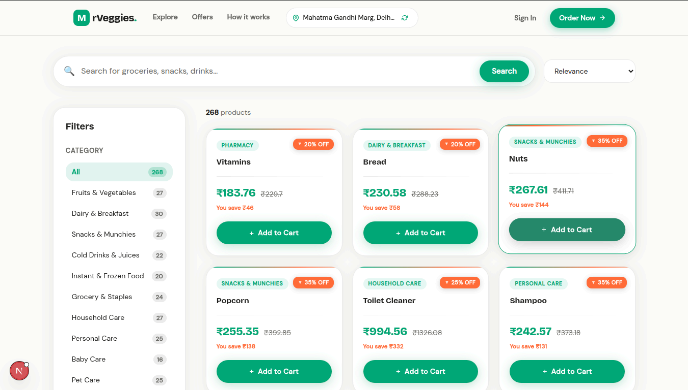
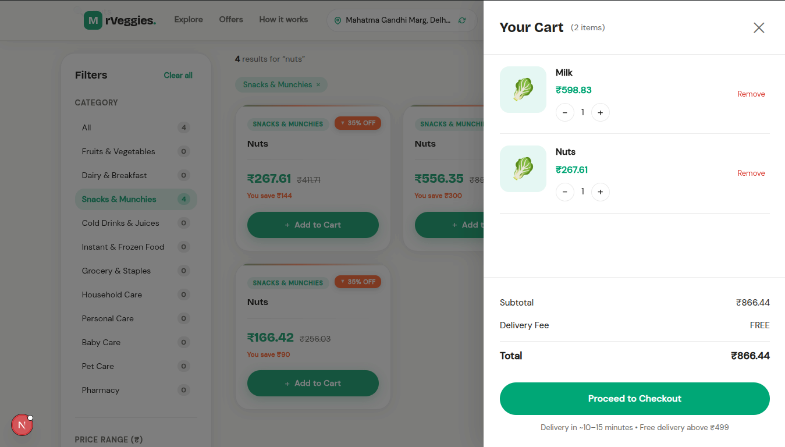
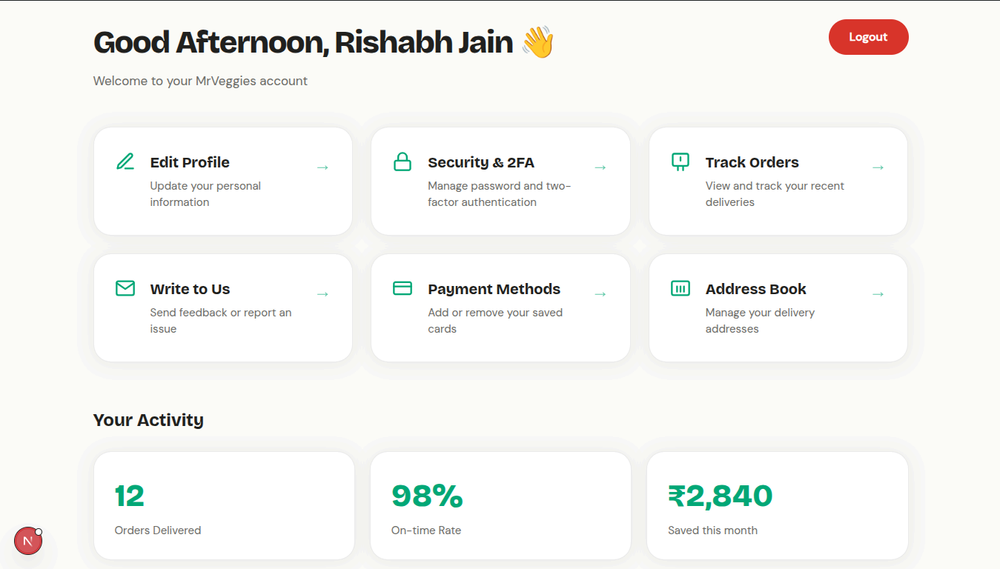

## MrVeggies Quick-Commerce Store

This portfolio project is a quick-commerce store built using Next.js, Zustand, and Firebase. It allows users to browse and purchase fresh vegetables, fruits and other daily products online. The application provides a seamless shopping experience with features such as product listing, shopping cart, and user authentication.

Live Hosted - [MrVeggies Store](https://mrveggies-qcommercestore.vercel.app)

### Features

- **Product Listing**: Users can browse through a variety of fresh vegetables, fruits, and other daily products with detailed descriptions and prices. The products are fetched from Firebase Firestore, ensuring real-time updates and efficient data management.
- **Shopping Cart**: Users can add products to their shopping cart, view the cart contents, and proceed to checkout. The cart state is managed using Zustand, providing a smooth and responsive user experience.
- **User Authentication**: Users can create an account, log in, and manage their profile. Authentication is handled using Firebase Authentication, ensuring secure access to user data and personalized shopping experience.
- **Interactive Dashboard**: The application includes an interactive dashboard for users to view their order history, manage their account settings, and track their orders in real-time.
- **Responsive Design**: The application is designed to be fully responsive, providing an optimal shopping experience across various devices, including desktops, tablets, and smartphones.

### Screenshots

Home Page

Product Listing Page

Getting Started Page

User Dashboard Page


### Technologies Used

- **Next.js**: A React framework for building server-side rendered applications, providing fast performance
- **Zustand**: A state management library for React, used to manage the shopping cart state efficiently.
- **Firebase**: A platform for building web and mobile applications, used for authentication and real-time database management with Firestore.
- **Kaggle Datasets**: The product data is sourced from Kaggle datasets, ensuring a wide variety of fresh vegetables, fruits, and daily products for users to choose from.

### Installation

To run the application locally, follow these steps:

1. Clone the repository:
   ```bash
   git clone git@github.com:rishabhjn13/MrVeggies-QCommerceStore.git
   ```
2. Navigate to the project directory:
   ```bash
   cd MrVeggies-QCommerceStore
   ```
3. Install the dependencies:
   ```bash
   npm install
   ```
4. Set up Firebase configuration in a `.env.local` file:
   ```env
   NEXT_PUBLIC_FIREBASE_API_KEY=
   NEXT_PUBLIC_FIREBASE_AUTH_DOMAIN=
   NEXT_PUBLIC_FIREBASE_PROJECT_ID=
   NEXT_PUBLIC_FIREBASE_STORAGE_BUCKET=
   NEXT_PUBLIC_FIREBASE_MESSAGING_SENDER_ID=
   NEXT_PUBLIC_FIREBASE_APP_ID=
   ```
5. Start the development server:
   ```bash
   npm run dev
   ```
6. Open your browser and navigate to `http://localhost:3000` to view the application.

### Seeding the Database
To seed the Firebase Firestore database with product data from Kaggle datasets, you can use the script `upload-csv-to-firestore.js` in releases. Follow the instructions in the release notes to run the seeding script and populate your Firestore database with the necessary product data.
- Make sure to update the Firebase configuration rules in the script before running it.
- Keep the service account key file secure and do not expose it in public repositories.
- Have the CSV files downloaded from Kaggle ready to be uploaded using the script.
- If using free plan, be mindful of the Firestore limits and consider seeding a smaller dataset to avoid hitting the limits.

Some of the datasets used for seeding the database include:
- [Blinkit Sales Dataset](https://www.kaggle.com/datasets/akxiit/blinkit-sales-dataset)
- [Amazon Sales Dataset](https://www.kaggle.com/datasets/karkavelrajaj/amazon-sales-dataset)
- [Flipkarts Products Dataset](https://www.kaggle.com/datasets/hamzanathwala/flipkart-sales-dataset)


